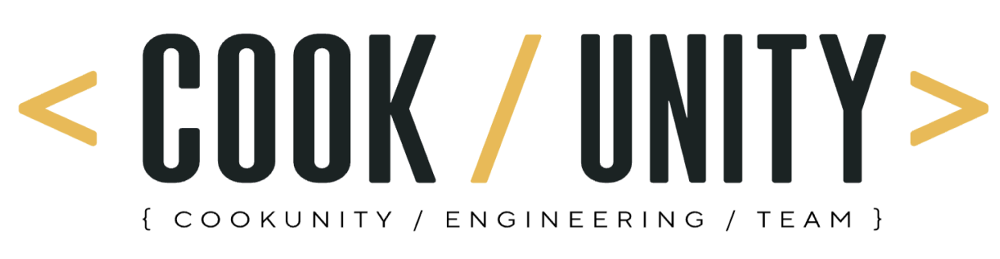
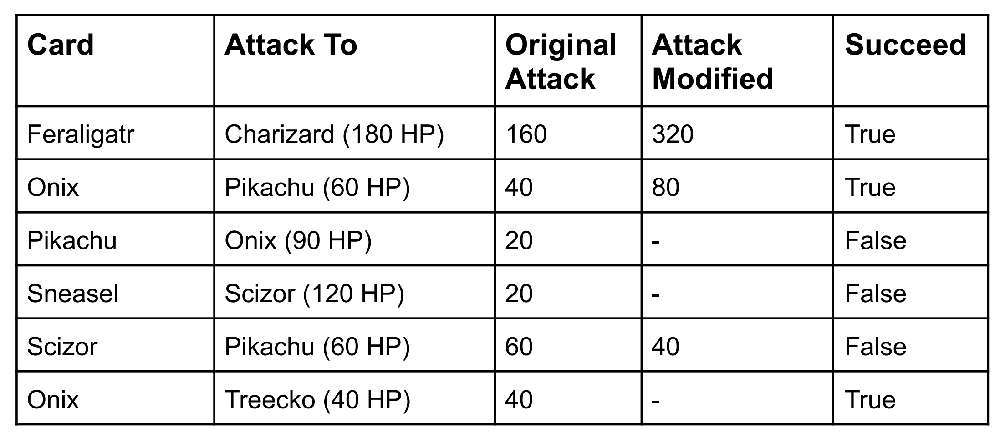
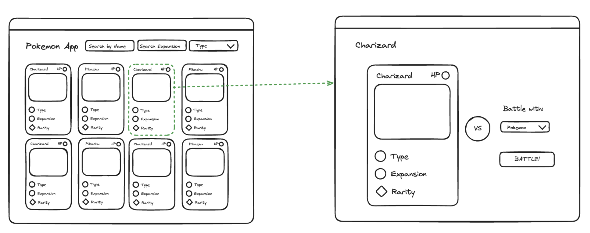

# Engineer Coding Challenge

## Purpose

As part of CookUnity's selection process, we request that candidates complete a small
project aimed at helping us grasp their skills, experiences, creativity, problem-solving
abilities, and knowledge.

## Backend

### Scope

Develop a RESTful API centered around Pokémon Cards that can be integrated with a
frontend or application, featuring the following functionalities:

- Creation of a new card.
- Updating an existing card.
- Retrieval of a specific card.
- Retrieval of all cards.
- Deletion of a card.
- Card Battle Simulation: Given a selected card, we aim to determine whether it
  can defeat another card in a single attack. This assessment considers factors
  such as weaknesses and resistances based on types. For instance, if Feraligatr
  (Water) attacks Charizard, it might not initially succeed, but based on Charizard's
  weakness (Water) could result in a 2x damage multiplier, granting victory to
  Feraligatr. Conversely, consider Scizor (Steel) facing Pikachu; here, Scizor's
  attack might only deal 40 points of damage based on the Pikachu's resistance
  (20 less for Steel), rendering it unsuccessful in the battle. You can see the details
  of the cards below.
- Identify Card Weaknesses and Resistances: Given a selected card, retrieve a list
  detailing which cards it is weak against and which it is resistant to. For example
  choosing Pikachu would reveal Onix as a weakness and Scizor as a resistance.




### Notes

- The solution must be implemented in Typescript. Feel free to use any framework.
  (e.g., NestJS)
- Postgres must be used as the database engine.
- Feel free to make any necessary assumptions regarding required fields, data
  structure, and validations.
- Data persistence is required.
- The solution should be hosted in a repository accessible to the CookUnity
  collaborator who issued the challenge.
- Upon completion, a document outlining the assumptions made, the implemented
  solution, and instructions for running it should be submitted to the CookUnity
  collaborator.
- Documentation of the API endpoints (e.g., Swagger) should be provided.

### Bonus

- Authentication
- Filtering
- Pagination
- Unit testing
- Deployment of the API to a cloud service (AWS, Azure, Google Cloud, etc.)
- Utilization of AWS services (API Gateway, Lambda, EC2, ECS, EKS, S3, etc.)

## Frontend

### Scope

Create a view capable of displaying all available cards, alongside another view
dedicated to showcasing a single selected card, with an option to engage in battles
against other cards.



### Notes

- The solution must be implemented in React with Typescript. Feel free to use any
  framework if you want. (e.g., Next.js)
- Feel free to make any necessary assumptions regarding required fields, data
  structure, and validations.
- Feel free to use any library or css preprocessor. (e.g., Styled Components, Sass)
- The solution should be hosted in a repository accessible to the CookUnity
  collaborator who issued the challenge.
- Upon completion, a document outlining the assumptions made, the implemented
  solution, and instructions for running it should be submitted to the CookUnity
  collaborator.

### Bonus

- Authentication
- Filtering
- Pagination
- Unit testing or e2e tests
- Deployment of the frontend

## Solution for FE Code Challenge

### Demo


### Implementation - Dependencies

The pokemon application was implemented in `Next.js` along with the following dependencies (among the most important ones):

- Typescript
- Tailwind CSS
- Shadcn
- Axios
- Prettier
- Eslint

### Assumptions

Since only the FE part was done, due to the lack of BE, the Pokemon public [PokeAPI](https://pokeapi.co/) was used to represent the Pokemon's data.

#### Pokemon Card

The following fields are used:

- `Name`:
  The name of the pokemon.

- `HP (Hit Points)`:
  It is a value that determines how much damage a Pokémon can receive.

- `Types`:
  Types are properties for Pokémon and their moves. Each type has three properties: which types of Pokémon it is super effective against, which types of Pokémon it is not very effective against, and which types of Pokémon it is completely ineffective against.

- `Abilities`:
  Abilities provide passive effects for Pokémon in battle or in the overworld. Pokémon have multiple possible abilities but can have only one ability at a time.

- `Weight`:
  The weight of the Pokemon in hectograms.

  ##### Notes

  Due [pokemon API](https://pokeapi.co/) doesn't have `Expansion` and `Rarity`, those where replaced by `Abilities` and `Weight`.

#### Battle

The following custom function, that returns a random winner, was implemented to simulate a battle between two pokemons.

```javascript
export function battle(player1: Player, player2: Player) {
  // Calculate random number for both players by multiply HP with a random factor
  const player1Value = Math.ceil(player1.hp * getRandomNumber(1, 10));
  const player2Value = Math.ceil(player2.hp * getRandomNumber(1, 10));

  // Calculate the absolute difference between player1 and BATTLE_GOAL, store it in x1
  const x1 = Math.abs(BATTLE_GOAL - player1Value);

  // Calculate the absolute difference between player2 and BATTLE_GOAL, store it in y1
  const y1 = Math.abs(BATTLE_GOAL - player2Value);

  if (x1 > y1) {
    // Return x if x is closer to BATTLE_GOAL
    return `${player1.name} wins!`;
  }

  // Return y if y is closer to BATTLE_GOAL
  if (y1 > x1) {
    return `${player2.name} wins!`;
  }

  // Return 0 if x and y are equidistant from BATTLE_GOAL
  return "No winners - try again!";
}
```

### Run app

1. After clone the repo.

2. Open a terminal and on the repo directory run:

   ```
   npm run dev
   ```

3. Open [http://localhost:3000](http://localhost:3000) with your browser to see the result.

4. Enjoy the app! 🙂
